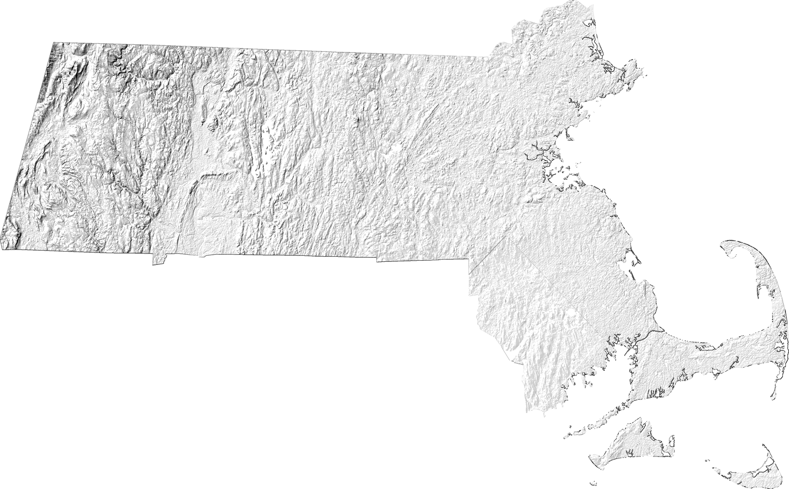

# Map-making with GDAL, D3, Puppeteer and Make
This project utilizes an array of tools to automate the creation of a map of Massachusetts. Starting point is Thomas Thoren's ["Making a New York Times Map"](https://thomasthoren.com/2016/02/28/making-a-new-york-times-map.html).

## Dependencies
* GDAL, Node, ImageMagick, D3, TopoJSON, Chrome Puppeteer

## To do
* Call Puppeteer script to scrape our database of Knollwood clients.
* Same for Enphase, SolarEdge.
* Switch to 30m SRTM tiles to avoid artefacts around the South Shore/Rhode Island border
* Use GDAL 2.2 (and Python 3) to open the SRTM files without de-compressing
